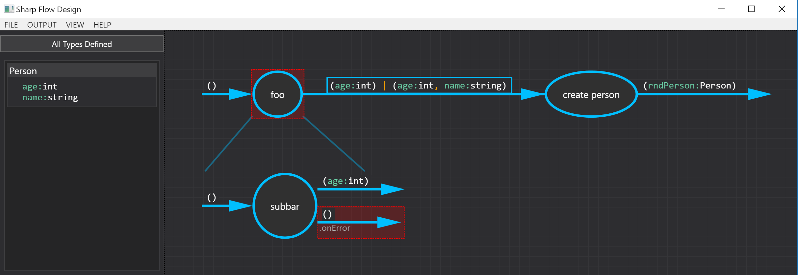

# Dexel
An edtior for creating Flow Designs diagramms and generating C# code out of it

## Install
- Download latest binary built: https://github.com/detachmode/Dexel/releases/download/v1.0.0/Release.v.1.0.0.zip
- Unzip file and run Dexel.Editor.exe

### Bachelor thesis in german:
https://github.com/detachmode/Dexel/raw/master/pdf/Flow%20Design%20Bachelor%20Thesis%20(german).pdf

### Disclaimer
This application was created in collaboration with IT Designers Gruppe in Esslingen Germany.
